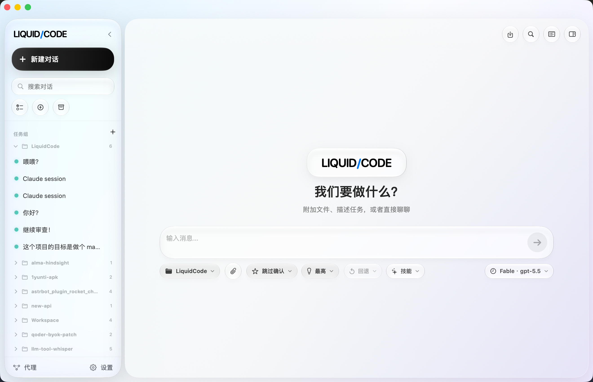

# LiquidCode

<p align="center">
  
</p>

LiquidCode is a native macOS app for Claude Code. It gives the CLI a proper
desktop home: project and session lists on the left, chat in the middle, and
Provider, MCP, Skills, and CLI setup in Settings instead of scattered dotfiles.

## Configure

- First launch guides you through Claude CLI/provider setup and can migrate
  existing provider configuration with backup/rollback.
- Open **Settings → Provider** to add Anthropic/OpenAI-compatible providers,
  model mappings, proxy, and extra environment variables.
- Open **Settings → MCP** to manage app-local MCP servers. LiquidCode also
  reads Claude MCP config and creates per-session scratch config when launching
  the CLI.
- Open **Settings → CLI** to diagnose, install, update, repair, or log in to
  Claude Code.

## Install from a local release build

1. Install Xcode with a modern macOS SDK (26/27).
2. Optional: copy `.env.example` → `.env` and set signing/notary identities for a notarized release.
3. Run:

```bash
./scripts/build-release.sh
# faster local smoke:
# LIQUIDCODE_ARCHS=arm64 ./scripts/build-release.sh
```

4. Install the generated `.build-release/LiquidCode-<version>[-unsigned].pkg`.

Version comes from Xcode `MARKETING_VERSION` / `CURRENT_PROJECT_VERSION` (written into the app Info.plist). Without signing variables the script produces an ad-hoc signed app inside an unsigned PKG (Gatekeeper will warn). Set `RELEASE_SIGNING_REQUIRED=1` for production gates.


### Verify

```bash
./scripts/verify-release-artifacts.sh
codesign --verify --deep --strict --verbose=2 .build-release/LiquidCode.app
lipo -archs .build-release/LiquidCode.app/Contents/MacOS/LiquidCode
```

### Artifacts

- `.pkg` — only installer format (installs to `/Applications/LiquidCode.app`)
- Intermediate `.build-release/LiquidCode.app` is kept for inspection; not uploaded by CI

In-app update checks (`UpdateService` / `latest.json`) are separate from packaging; packaging no longer emits DMG, updater tarballs, or `latest.json`.


## Release gates

```bash
xcodebuild test \
  -project LiquidCode.xcodeproj \
  -scheme LiquidCode \
  -configuration Debug \
  -destination 'platform=macOS,arch=arm64' \
  -derivedDataPath .xcode-derived
LIQUIDCODE_ARCHS=arm64 RELEASE_UPLOAD_DRY_RUN=1 ./scripts/build-release.sh

./scripts/verify-release-artifacts.sh
```

## Release artifacts

- `LiquidCode.app` comes from the Xcode `.xcarchive` (kept under `.build-release/` for inspection).
- `.pkg` is the only shipped installer (installs to `/Applications/LiquidCode.app`).
- PKG filename uses `CFBundleShortVersionString` from the built app (sourced from Xcode `MARKETING_VERSION`).

## Versioning & tags

- **Source of truth:** `MARKETING_VERSION` / `CURRENT_PROJECT_VERSION` in `LiquidCode.xcodeproj`.
- **Inspect:** `./scripts/verify-version.sh`
- **Cut a release tag:** automatic — every green push to `main` makes CI tag `v${MARKETING_VERSION}` and publish an unsigned PKG release. Manual escape hatch: `./scripts/cut-release.sh`.
- **Optional override:** `RELEASE_TAG` only for upload override; it must still match `MARKETING_VERSION`. Leave it unset to use `v${MARKETING_VERSION}` automatically.

## Update

- Local: rerun `./scripts/build-release.sh`, install the new PKG, relaunch.
- Dry-run upload: `RELEASE_UPLOAD_DRY_RUN=1 ./scripts/build-release.sh` (tag defaults from Xcode).
- Production upload: `RELEASE_SIGNING_REQUIRED=1` plus Developer ID Application, Developer ID Installer, and notary profile; then `RELEASE_UPLOAD=1`.


## Uninstall

Quit LiquidCode, delete `/Applications/LiquidCode.app`, and optionally remove:

- `~/Library/Application Support/LiquidCode`
- `~/Library/Logs/LiquidCode`
- `~/Library/Preferences/moe.aili.LiquidCode.plist`

## Development quality gate

Install the pinned local tooling and enable the tracked Git hook before committing:

```bash
brew bundle install
./scripts/install-git-hooks.sh
```

The pre-commit hook runs `./scripts/quality-check.sh`. It fails closed when
`swiftlint`, `swiftformat`, or `periphery` is missing, then runs SwiftLint,
SwiftFormat lint mode, and Periphery. It intentionally does not run XCTest;
use the build/test commands below for full verification.

### Build & test

```bash
xcodebuild test \
  -project LiquidCode.xcodeproj \
  -scheme LiquidCode \
  -configuration Debug \
  -destination 'platform=macOS,arch=arm64' \
  -derivedDataPath .xcode-derived
# Development smoke path: uses the same default DerivedData location as Xcode.app.
./scripts/dev-run.sh
# Release/archive path: intentionally isolated under .xcode-derived.
xcodebuild \
  -project LiquidCode.xcodeproj \
  -scheme LiquidCode \
  -configuration Release \
  -derivedDataPath .xcode-derived \
  build
```


## Continuous Integration

GitHub Actions workflows:

| Workflow | Trigger | Purpose |
|---|---|---|
| `CI` (`.github/workflows/ci.yml`) | PR / push to main | Quality gate, unit tests, unsigned arm64 PKG build; on green `main` auto-tags `v${MARKETING_VERSION}` and publishes an unsigned PKG release |
| `Release` (`.github/workflows/release.yml`) | `v*` tags / published release / manual | Signed + notarized PKG release (when Apple secrets present) |

Local helpers used by CI:

```bash
./scripts/verify-version.sh              # MARKETING_VERSION / build number
./scripts/verify-version.sh --tag vX.Y.Z # tag must match MARKETING_VERSION
./scripts/ci-select-xcode.sh             # pick Xcode with macOS 26/27 SDK
./scripts/build-release.sh               # archive → PKG only (version from Xcode)
./scripts/verify-release-artifacts.sh    # codesign / lipo / PKG payload checks
./scripts/cut-release.sh --dry-run       # preview tag from MARKETING_VERSION
./scripts/cut-release.sh                 # create+push vX.Y.Z tag

```

Signing mode is all-or-nothing: configure every Apple app+installer+notary secret,
or configure none for unsigned PKG. Partial secret sets fail the Release workflow.

## Acknowledgements

[TOKENICODE](https://github.com/yiliqi78/TOKENICODE): A Beautiful Desktop Client for Claude Code
