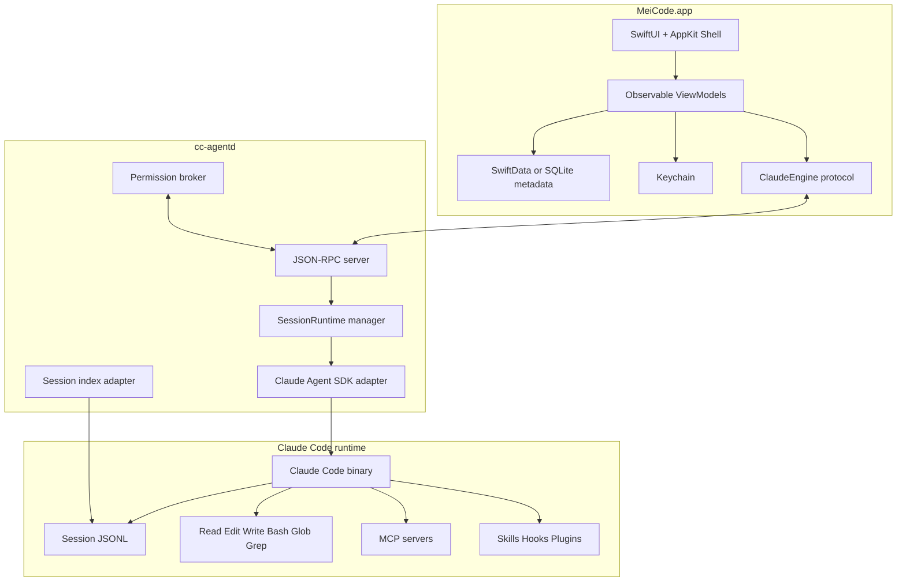

# macOS 原生 Claude Code GUI 架构设计

状态：设计稿  
目标平台：macOS 27 优先，保留 macOS 26+ 降级边界  
核心方案：SwiftUI/AppKit 原生 GUI + Claude Agent SDK sidecar + Liquid Glass 视觉系统  
非目标：Tauri、WebView、重写 Claude Code agent loop

## 1. 产品目标

做一个 macOS 一等公民的 Claude Code GUI。

它应该像系统 App：

- 使用 SwiftUI 和 AppKit 构建窗口、菜单、快捷键、sheet、toolbar、split view。
- 使用 macOS Liquid Glass 表达侧栏、工具栏、输入框、权限审批卡片和浮层。
- 使用 Keychain 保存 API key。
- 使用原生文件选择、项目授权、通知和诊断日志。
- 通过 Claude Agent SDK 驱动 Claude Code，不重新实现 coding agent。

产品边界：

- App 负责 UI、配置、会话列表、权限审批、项目体验。
- Claude Code 负责 agent loop、工具执行、MCP、skills、hooks、session transcript。
- Sidecar 负责把 Claude Agent SDK 转换成稳定的本地 RPC 服务。

一句话：

```text
一个原生 macOS Claude Code 客户端，用系统级 UI 管理 Claude Code 的会话、工具、权限和项目上下文。
```

## 2. 核心决策

### 2.1 不使用 Tauri

主 App 不使用 Tauri，也不使用 WebView 作为 UI 主体。

原因：

- Tauri 的 UI 仍然运行在 `WKWebView` 内。
- Liquid Glass 的关键体验来自 AppKit/SwiftUI 的窗口结构、toolbar、sidebar、sheet、菜单和控件。
- WebView 与原生 glass surface 叠层会带来坐标同步、hit-test、透明背景、滚动性能和 accessibility 问题。
- 本项目目标是 macOS 原生产品，不是跨平台 GUI。

保留原则：

```text
SwiftUI/AppKit 是 UI 主体。
Sidecar 是 runtime 边界。
Claude Code 是 agent 能力来源。
```

### 2.2 使用 Claude Agent SDK sidecar

Swift App 不直接链接 Claude Agent SDK。Claude Agent SDK 目前提供 TypeScript/Python SDK，本项目使用 TypeScript sidecar 封装它。

主 App 通过 JSON-RPC 与 sidecar 通信。

优点：

- Swift UI 不绑定 SDK 内部 message schema。
- Sidecar 可以独立升级、重启和诊断。
- Agent SDK 的 `query()`、streaming、permissions、sessions、MCP 能力可以保留。
- 如果 SDK 变更，只改 sidecar adapter。

### 2.3 保留 Direct CLI fallback

Direct CLI runner 不作为主路径，但要保留。

用途：

- Agent SDK 初始化失败时兜底。
- 调试 Claude Code stream-json。
- 做最小 POC。
- 帮助定位 sidecar 与 Claude Code 的边界问题。

Direct CLI fallback 只实现基础能力：启动、流式输出、resume、interrupt。权限审批和长会话仍以 sidecar 为主。

### 2.4 不重写 Claude Code

本项目不实现自己的 agent loop。

不做：

- 自研 Read/Edit/Write/Bash 工具协议。
- 自研 MCP client。
- 自研 session transcript。
- 自研 hooks/skills/plugins。
- 自研 checkpoint。

原因：这会把项目变成另一个 coding agent，而不是 Claude Code GUI。

## 3. 总体架构



## 4. 进程模型

### 4.1 主 App 进程

职责：

- 渲染原生 UI。
- 管理窗口、菜单、快捷键、sheet、通知。
- 管理项目列表和会话 metadata。
- 从 Keychain 读写 API key。
- 启动、监控、重启 sidecar。
- 向 sidecar 发送用户消息和权限决策。
- 接收 sidecar event 并更新 UI。

技术栈：

- Swift 6
- SwiftUI
- AppKit
- Swift Concurrency
- SwiftData 或 SQLite
- Keychain Services
- Foundation `Process` / `Pipe`

### 4.2 Sidecar 进程：`cc-agentd`

职责：

- 封装 `@anthropic-ai/claude-agent-sdk`。
- 管理运行中的 Claude sessions。
- 把 SDK message 转换成本项目稳定事件。
- 实现 `canUseTool` 权限回调。
- 处理 streaming input/output。
- 提供 JSON-RPC API。
- 统一错误模型。
- 管理 Claude Code binary 路径。

技术栈：

- TypeScript
- Claude Agent SDK
- JSON-RPC over stdio
- Bun compile 或打包 Node runtime

### 4.3 Claude Code runtime

职责：

- 执行 agent loop。
- 调用内置工具和 MCP 工具。
- 读写项目文件。
- 执行 Bash。
- 存储 transcript。
- 加载 skills、hooks、plugins。

来源优先级：

1. Agent SDK bundled Claude Code binary。
2. App 指定的内置 Claude Code binary。
3. 用户系统 PATH 中的 `claude`。
4. 用户手动选择的 Claude Code binary。

## 5. 通信协议

### 5.1 v0.1 使用 stdio JSON-RPC

主 App 启动 sidecar 子进程：

```text
MeiCode.app/Contents/Resources/cc-agentd
```

通信管道：

- App 写 sidecar stdin。
- App 读 sidecar stdout。
- App 读 sidecar stderr 并写 debug log。

每一行都是一个 JSON object。

优点：

- 不开本地端口。
- 不需要 socket 权限。
- 生命周期与 App 绑定。
- 崩溃检测简单。
- 便于打包和调试。

后续可以迁移到 Unix domain socket 或 XPC，但 v0.1 不需要。

### 5.2 JSON-RPC Envelope

请求：

```json
{
  "jsonrpc": "2.0",
  "id": "req_001",
  "method": "session.start",
  "params": {}
}
```

响应：

```json
{
  "jsonrpc": "2.0",
  "id": "req_001",
  "result": {}
}
```

错误：

```json
{
  "jsonrpc": "2.0",
  "id": "req_001",
  "error": {
    "code": "CLAUDE_PROCESS_FAILED",
    "message": "Claude process exited unexpectedly",
    "details": {}
  }
}
```

事件：

```json
{
  "jsonrpc": "2.0",
  "method": "event",
  "params": {
    "sessionId": "uuid",
    "type": "assistant.text.delta",
    "payload": {}
  }
}
```

### 5.3 协议版本

所有 sidecar handshake 必须返回协议版本。

```json
{
  "protocolVersion": 1,
  "sidecarVersion": "0.1.0",
  "sdkVersion": "0.3.x",
  "claudeCodeVersion": "2.x"
}
```

主 App 发现不兼容版本时，应阻止继续运行并显示升级提示。

## 6. RPC Methods

### 6.1 `engine.initialize`

App 启动后第一条消息。

请求：

```json
{
  "appVersion": "0.1.0",
  "protocolVersion": 1,
  "capabilities": {
    "supportsPermissionSheet": true,
    "supportsImages": true,
    "supportsMcpUi": true
  }
}
```

返回：

```json
{
  "protocolVersion": 1,
  "sidecarVersion": "0.1.0",
  "sdkVersion": "0.3.x",
  "claudeCodeVersion": "2.x",
  "features": {
    "streamingInput": true,
    "partialMessages": true,
    "permissions": true,
    "sessions": true,
    "mcp": true
  }
}
```

### 6.2 `session.start`

创建新 session，或 resume/fork 旧 session。

请求：

```json
{
  "projectPath": "/Users/starshine/Code/project",
  "initialMessage": {
    "content": "Analyze this project"
  },
  "options": {
    "model": "sonnet",
    "permissionMode": "default",
    "allowedTools": ["Read", "Glob", "Grep"],
    "disallowedTools": ["Bash(rm *)"],
    "includePartialMessages": true,
    "resume": null,
    "forkSession": false,
    "mcpConfig": null,
    "environment": {
      "ANTHROPIC_API_KEY": "keychain-ref:anthropic"
    }
  }
}
```

返回：

```json
{
  "sessionId": "uuid",
  "runtimeId": "runtime_abc",
  "projectPath": "/Users/starshine/Code/project"
}
```

### 6.3 `session.send`

向已有 session 发送用户消息。

请求：

```json
{
  "sessionId": "uuid",
  "message": {
    "role": "user",
    "content": [
      {
        "type": "text",
        "text": "Now implement the plan"
      }
    ]
  }
}
```

返回：

```json
{
  "queued": true
}
```

### 6.4 `session.interrupt`

中断当前 turn。

请求：

```json
{
  "sessionId": "uuid"
}
```

返回：

```json
{
  "interrupted": true
}
```

要求：

- sidecar 取消当前 SDK query。
- pending permission 自动拒绝或取消。
- UI 标记当前 turn 为 interrupted。
- 不删除 transcript。

### 6.5 `session.setPermissionMode`

动态切换权限模式。

请求：

```json
{
  "sessionId": "uuid",
  "mode": "acceptEdits"
}
```

支持值：

```text
default
dontAsk
acceptEdits
plan
auto
bypassPermissions
```

规则：

- 默认使用 `default`。
- `bypassPermissions` 必须在 UI 中二次确认。
- `plan` 模式下，文件写入和 shell 写操作必须走审批。

### 6.6 `permission.respond`

用户处理工具审批请求。

允许：

```json
{
  "requestId": "perm_001",
  "decision": {
    "behavior": "allow",
    "updatedInput": {
      "command": "npm test"
    }
  }
}
```

拒绝：

```json
{
  "requestId": "perm_001",
  "decision": {
    "behavior": "deny",
    "message": "Do not run install commands in this project"
  }
}
```

允许并记住：

```json
{
  "requestId": "perm_001",
  "decision": {
    "behavior": "allow",
    "updatedInput": {
      "command": "npm test"
    },
    "remember": {
      "scope": "session",
      "rule": "Bash(npm test *)"
    }
  }
}
```

v0.1 只实现 session 级 remember，不写全局 settings。

### 6.7 `sessions.list`

列出历史 session。

请求：

```json
{
  "projectPath": "/Users/starshine/Code/project",
  "limit": 50,
  "includeWorktrees": true
}
```

返回：

```json
{
  "sessions": [
    {
      "sessionId": "uuid",
      "summary": "Fix auth bug",
      "createdAt": 1760000000000,
      "lastModified": 1760000100000,
      "cwd": "/Users/starshine/Code/project",
      "gitBranch": "main"
    }
  ]
}
```

### 6.8 `sessions.messages`

读取历史 transcript。

请求：

```json
{
  "sessionId": "uuid",
  "projectPath": "/Users/starshine/Code/project",
  "limit": 200,
  "offset": 0
}
```

返回：

```json
{
  "messages": []
}
```

## 7. Sidecar 设计

### 7.1 SessionRuntime

每个运行中的 Claude session 对应一个 runtime object。

```ts
type SessionRuntime = {
  sessionId: string;
  runtimeId: string;
  projectPath: string;
  status: "starting" | "running" | "waiting_for_user" | "completed" | "failed" | "interrupted";
  inputQueue: AsyncMessageQueue;
  abortController: AbortController;
  pendingPermissions: Map<string, PendingPermission>;
  options: RuntimeOptions;
};
```

### 7.2 输入队列

`session.send` 不直接调用 SDK。它把用户消息推入 runtime 的 queue。

```ts
class AsyncMessageQueue {
  push(message: SDKUserMessage): void;
  close(): void;
  next(): Promise<SDKUserMessage | null>;
}
```

SDK 使用 async generator 读取 queue：

```ts
async function* messageGenerator(queue: AsyncMessageQueue) {
  while (true) {
    const message = await queue.next();
    if (!message) break;
    yield message;
  }
}
```

### 7.3 SDK query adapter

概念代码：

```ts
const q = query({
  prompt: messageGenerator(runtime.inputQueue),
  options: {
    cwd: runtime.projectPath,
    includePartialMessages: true,
    permissionMode: runtime.options.permissionMode,
    allowedTools: runtime.options.allowedTools,
    disallowedTools: runtime.options.disallowedTools,
    canUseTool: async (toolName, input, context) => {
      return await permissionBroker.request({
        sessionId: runtime.sessionId,
        toolName,
        input,
        context,
      });
    },
  },
});

for await (const message of q) {
  rpc.emit(convertSdkMessage(runtime.sessionId, message));
}
```

### 7.4 PermissionBroker

职责：把 SDK `canUseTool` callback 转成 GUI 权限请求。

```ts
async function request(req: ToolPermissionRequest) {
  const requestId = createId("perm");
  const pending = pendingPermissionMap.create(requestId);

  rpc.emit({
    type: "permission.requested",
    sessionId: req.sessionId,
    requestId,
    toolName: req.toolName,
    input: req.input,
    suggestions: req.context.suggestions ?? [],
  });

  const decision = await pending.promise;

  if (decision.behavior === "allow") {
    return {
      behavior: "allow",
      updatedInput: decision.updatedInput ?? req.input,
    };
  }

  return {
    behavior: "deny",
    message: decision.message ?? "User denied this action",
  };
}
```

要求：

- Permission request 可以长期 pending。
- App 退出时必须 reject 所有 pending permission。
- Session interrupt 时必须 reject 当前 session 的 pending permission。
- Sidecar 不能自动批准未知工具。

### 7.5 Event converter

Sidecar 把 SDK message 转成 App 事件。

| SDK message | App event |
|---|---|
| system init | `session.started` |
| text delta | `assistant.text.delta` |
| assistant complete | `assistant.message.completed` |
| tool start | `tool.started` |
| tool input delta | `tool.input.delta` |
| tool result | `tool.completed` |
| result success | `turn.completed` |
| result error | `turn.failed` |
| canUseTool | `permission.requested` |
| AskUserQuestion | `user_question.requested` |

App 不消费 SDK 原始类型，避免 SDK 升级污染 UI。

## 8. Swift App 架构

### 8.1 模块结构

```text
AppShell/
  MeiCodeApp.swift
  MainWindowController.swift
  AppShellView.swift
  MainSplitViewController.swift

NativeGlass/
  GlassPanel.swift
  NativeGlassHost.swift
  GlassToolbarController.swift
  GlassSidebarController.swift
  GlassAccessibilityPolicy.swift

ClaudeEngine/
  ClaudeEngine.swift
  SidecarClaudeEngine.swift
  DirectCLIClaudeEngine.swift
  ClaudeEvent.swift
  ClaudeModels.swift

Sidecar/
  SidecarProcess.swift
  JsonRpcClient.swift
  JsonLineReader.swift
  SidecarHealthMonitor.swift

Permissions/
  PermissionRequest.swift
  PermissionSheet.swift
  PermissionRiskClassifier.swift
  PermissionDecisionStore.swift

Sessions/
  SessionListView.swift
  SessionRecord.swift
  SessionStore.swift
  TranscriptLoader.swift

Projects/
  ProjectPicker.swift
  ProjectRecord.swift
  ProjectBookmarkStore.swift

Files/
  FileTreeService.swift
  FileExplorerView.swift
  DiffViewer.swift
  ExternalEditorLauncher.swift

Settings/
  SettingsView.swift
  ProviderSettingsView.swift
  MCPSettingsView.swift
  KeychainStore.swift

Diagnostics/
  LogStore.swift
  DiagnosticsBundle.swift
  CrashReporter.swift
```

### 8.2 ClaudeEngine Protocol

UI 只依赖这个协议。

```swift
protocol ClaudeEngine {
    func initialize() async throws -> EngineCapabilities
    func startSession(_ request: StartSessionRequest) async throws -> ClaudeSessionID
    func sendMessage(_ sessionID: ClaudeSessionID, _ message: UserMessage) async throws
    func events(for sessionID: ClaudeSessionID) -> AsyncStream<ClaudeEvent>
    func interrupt(_ sessionID: ClaudeSessionID) async throws
    func setPermissionMode(_ sessionID: ClaudeSessionID, _ mode: PermissionMode) async throws
    func respondToPermission(_ requestID: PermissionRequestID, _ decision: PermissionDecision) async throws
    func listSessions(projectPath: String) async throws -> [ClaudeSessionSummary]
    func loadTranscript(_ sessionID: ClaudeSessionID, projectPath: String) async throws -> [TranscriptItem]
}
```

实现：

- `SidecarClaudeEngine`：主实现。
- `DirectCLIClaudeEngine`：fallback。
- `MockClaudeEngine`：UI preview 和测试用。

### 8.3 ViewModel

主状态集中在几个 view model：

```swift
@Observable final class WorkspaceModel {
    var selectedProject: ProjectRecord?
    var selectedSession: SessionRecord?
    var sessions: [SessionRecord]
    var inspectorMode: InspectorMode
}

@Observable final class ChatModel {
    var messages: [TranscriptItem]
    var currentStreamingText: String
    var toolCalls: [ToolCall]
    var status: ChatStatus
}

@Observable final class PermissionModel {
    var pendingRequests: [PermissionRequest]
    var activeRequest: PermissionRequest?
}
```

规则：

- Engine event 只进 ViewModel。
- SwiftUI View 不直接调用 JSON-RPC。
- 所有 side effect 放在 Model/Service 层。

## 9. Liquid Glass UI 设计

### 9.1 使用位置

使用 Liquid Glass 的区域：

- 主 toolbar。
- Sidebar。
- Inspector。
- Input composer。
- Permission sheet。
- Command palette。
- Floating tool cards。
- Search field。

不使用 Liquid Glass 的区域：

- 代码正文。
- Markdown 正文。
- 长日志。
- diff 内容区域。
- 长聊天消息正文背景。

理由：coding 工具以可读性为核心。Glass 表达功能层和空间层级，不承担正文背景。

### 9.2 GlassRole

```swift
enum GlassRole {
    case sidebar
    case toolbar
    case inspector
    case composer
    case commandPalette
    case permissionSheet
    case floatingCard
}
```

### 9.3 GlassProminence

```swift
enum GlassProminence {
    case subtle
    case regular
    case prominent
}
```

### 9.4 SwiftUI 入口

```swift
struct GlassPanel<Content: View>: View {
    let role: GlassRole
    let prominence: GlassProminence
    let content: Content

    var body: some View {
        NativeGlassHost(role: role, prominence: prominence) {
            content
        }
    }
}
```

### 9.5 AppKit Bridge

如果 SwiftUI glass modifier 无法覆盖需求，使用 `NSViewRepresentable` 包装 AppKit glass view。

```swift
struct NativeGlassHost<Content: View>: NSViewRepresentable {
    let role: GlassRole
    let prominence: GlassProminence
    let content: Content

    func makeNSView(context: Context) -> NSView {
        let glass = NSGlassEffectView()
        let host = NSHostingView(rootView: content)
        glass.contentView = host
        return glass
    }

    func updateNSView(_ nsView: NSView, context: Context) {
        // Update role, tint, corner radius, accessibility fallback.
    }
}
```

### 9.6 Glass grouping

相邻 glass controls 要放入同一个 container。

```text
NSGlassEffectContainerView
  ├── New Chat button
  ├── Search field
  └── Settings button
```

原因：多个 glass 元素共享采样区域，减少视觉不一致和渲染成本。

### 9.7 Accessibility fallback

必须支持：

- Reduce Transparency
- Increase Contrast
- VoiceOver
- Full Keyboard Access
- Light Mode
- Dark Mode

规则：

```text
Reduce Transparency = true
  GlassPanel -> opaque material

Increase Contrast = true
  increase border contrast
  increase text contrast
  reduce background bleed

VoiceOver = true
  PermissionSheet buttons require clear label and hint
```

## 10. 主窗口布局

### 10.1 Window

使用 AppKit 管主窗口。

```text
NSWindow
  contentViewController = MainSplitViewController
  toolbar = NativeToolbar
  titlebar = transparent or glass-aware
```

### 10.2 Split View

```text
NSSplitViewController
  ├── Sidebar split item
  ├── Chat workspace split item
  └── Inspector split item
```

Sidebar：

- 项目列表。
- 会话列表。
- New Chat。
- Settings。

Main：

- Chat timeline。
- Tool activity strip。
- Input composer。

Inspector：

- Files。
- MCP。
- Skills。
- Agent Activity。

### 10.3 Command Palette

原生浮层，使用 glass prominent panel。

功能：

- New Chat。
- Switch Project。
- Switch Session。
- Open Settings。
- Toggle Inspector。
- Run slash command。
- Search files。

快捷键：

```text
Cmd+K
```

## 11. 权限审批设计

### 11.1 PermissionRequest

```swift
struct PermissionRequest: Identifiable {
    let id: String
    let sessionId: String
    let toolName: String
    let title: String
    let summary: String
    let risk: PermissionRisk
    let input: JSONValue
    let suggestions: [PermissionSuggestion]
}
```

### 11.2 PermissionRisk

```swift
enum PermissionRisk {
    case readOnly
    case write
    case shell
    case destructive
    case network
    case externalMcp
}
```

### 11.3 风险分类

基本规则：

- `Read`, `Glob`, `Grep`：readOnly。
- `Edit`, `Write`：write。
- `Bash`：shell。
- `Bash` 包含 `rm`, `sudo`, `chmod`, `chown`, `curl | sh`, `dd`, `mkfs`：destructive。
- MCP tool 名或 server 表示外部系统写入：externalMcp。
- 网络、浏览器、HTTP 类工具：network。

### 11.4 PermissionSheet UI

Bash 请求：

```text
Claude wants to run a command

Command:
npm test

Working directory:
/Users/starshine/Code/project

Actions:
Allow Once
Allow for Session
Deny
Edit Command
```

Edit/Write 请求：

```text
Claude wants to edit a file

File:
src/auth.ts

Preview:
diff view

Actions:
Allow Once
Allow for Session
Deny
Open Full Diff
```

MCP 请求：

```text
Claude wants to use an MCP tool

Server:
github

Tool:
create_issue

Input:
structured preview

Actions:
Allow Once
Deny
```

### 11.5 决策规则

Allow Once：返回 allow。

Allow for Session：

- 写入内存 session rule。
- 当前请求返回 allow。
- 后续同类请求 sidecar 自动批准。

Deny：返回 deny message。

Edit Command：修改 input 后 allow。

v0.1 不提供全局 remember，避免误授权。

## 12. 会话管理

### 12.1 Claude transcript 是事实来源

Claude Code/SDK 负责 transcript。

App 只存 UI metadata：

```swift
struct SessionRecord {
    let sessionId: String
    let projectPath: String
    var title: String
    var pinned: Bool
    var archived: Bool
    var lastOpenedAt: Date
    var createdAt: Date
    var branch: String?
    var uiPreview: String?
}
```

### 12.2 App metadata 存储

路径：

```text
~/Library/Application Support/MeiCode/App.sqlite
```

或 SwiftData 默认 container。

### 12.3 Session 功能

v0.1：

- 新建 session。
- Resume session。
- 按项目列出 session。
- Rename。
- Pin。
- Archive。
- 删除 App metadata。
- 打开 transcript 所在位置。

v0.2：

- Search sessions。
- Export Markdown。
- Export JSON。
- Fork session。
- Tags。
- Worktree grouping。

## 13. 项目与文件访问

### 13.1 项目选择

使用 `NSOpenPanel` 选择目录。

保存：

```swift
struct ProjectRecord {
    let id: String
    let path: String
    var displayName: String
    var lastOpenedAt: Date
    var bookmarkData: Data?
}
```

### 13.2 Sandboxing 策略

v0.x 不走 Mac App Store sandbox。

发布方式：

```text
Developer ID signed + notarized DMG
```

原因：

- Claude Code 需要读写项目文件。
- Bash 工具需要执行项目命令。
- MCP server 可能启动外部进程或访问网络。
- Sandbox 会显著增加权限和 helper 复杂度。

如果后续必须上 Mac App Store，需要重新设计 sandbox helper 和 security-scoped bookmark，不在 v0.x 主线内做。

## 14. Secrets 与 Provider

### 14.1 API key

所有 API key 存 Keychain。

Keychain item：

```text
service: moe.aili.MeiCode
account: provider:<provider-id>:api-key
```

App DB 只存 keychain reference，不存明文 key。

### 14.2 ProviderRecord

```swift
struct ProviderRecord {
    let id: String
    var name: String
    var kind: ProviderKind
    var baseURL: URL?
    var modelMappings: [ModelTier: String]
    var keychainRef: String
}
```

### 14.3 注入方式

App 启动 session 前从 Keychain 读取 key，把它放入 sidecar request 的 environment。

Sidecar 要求：

- key 只在内存中存在。
- key 不写日志。
- key 不写配置文件。
- sidecar crash 后 key 从内存消失。

## 15. MCP 管理

### 15.1 配置原则

App 不自动修改用户的 `~/.claude.json`。

支持：

- App-local MCP profile。
- Project-local MCP profile。
- Import from Claude config。
- Export to Claude config。
- Test server。
- Enable/disable server。

App-local path：

```text
~/Library/Application Support/MeiCode/mcp.json
```

Project-local path：

```text
<project>/.meicode/mcp.json
```

### 15.2 MCP UI

MCP panel 显示：

```text
Server name
Transport: stdio/http/sse
Status: connected/failed/disabled
Tools count
Last error
Config source
```

操作：

- Add。
- Edit。
- Test。
- Enable。
- Disable。
- Import。
- Export。

### 15.3 MCP 权限展示

MCP tool permission 必须展示：

- Server name。
- Tool name。
- Input preview。
- External system risk。
- Whether write/destructive/open-world。

## 16. Skills 管理

v0.1 只做只读展示：

- 列出 Claude Code 可发现的 skills。
- 显示名称、描述、来源路径。
- 点击查看内容。

v0.2 再做编辑：

- 创建 user skill。
- 编辑 user skill。
- enable/disable。
- project skill 管理。

规则：

- 不自动改用户 skill 文件。
- 编辑前显示路径。
- 删除前二次确认。

## 17. 文件与 Diff

### 17.1 v0.1 文件能力

先做这些：

- File tree。
- File preview。
- Changed files marker。
- Open in external editor。
- Diff viewer。
- Reveal in Finder。

不做完整代码编辑器。

理由：原生代码编辑器成本高，MVP 的核心是 Claude Code GUI、权限和 diff 审查。

### 17.2 Diff viewer

要求：

- 支持 unified diff。
- 支持 side-by-side 后续版本。
- 支持按文件折叠。
- 支持打开文件。
- 支持从 permission sheet 进入完整 diff。

### 17.3 v0.2 编辑器

后续再实现：

- TextKit 2。
- 语法高亮。
- 搜索。
- 保存。
- dirty state。
- 外部修改冲突提示。

不要为了 CodeMirror 引入 WebView。

## 18. Tool Activity UI

### 18.1 ToolCall 模型

```swift
struct ToolCall: Identifiable {
    let id: String
    let sessionId: String
    let name: String
    let displayName: String
    var status: ToolStatus
    var inputPreview: String
    let startedAt: Date
    var completedAt: Date?
    var resultPreview: String?
}
```

状态：

```swift
enum ToolStatus {
    case streamingInput
    case waitingForPermission
    case running
    case succeeded
    case failed
    case denied
}
```

### 18.2 Tool card

Timeline 中每个 tool call 显示为可折叠卡片：

```text
Bash npm test
Status: succeeded
Duration: 4.2s
Output preview: 42 tests passed
```

Read：

- 文件路径。
- offset/limit。
- 结果摘要。

Bash：

- command。
- cwd。
- stdout/stderr。
- exit code。

Edit/Write：

- file path。
- diff preview。
- changed lines。

MCP：

- server。
- tool。
- input。
- result。

## 19. Error Model

Sidecar 统一错误格式：

```ts
type EngineError = {
  code:
    | "SIDECAR_START_FAILED"
    | "SDK_INIT_FAILED"
    | "CLAUDE_BINARY_NOT_FOUND"
    | "AUTH_REQUIRED"
    | "PROJECT_ACCESS_DENIED"
    | "SESSION_NOT_FOUND"
    | "PERMISSION_CANCELLED"
    | "CLAUDE_PROCESS_FAILED"
    | "MCP_SERVER_FAILED"
    | "PROTOCOL_VERSION_MISMATCH"
    | "UNKNOWN";
  message: string;
  recoverable: boolean;
  details?: unknown;
};
```

UI 行为：

- `recoverable = true`：显示修复动作，如重新登录、选择 binary、重试。
- `recoverable = false`：显示错误详情和复制诊断按钮。
- 所有错误写本地日志。
- 日志不得包含 API key 和完整 secret。

## 20. 日志与诊断

### 20.1 路径

App log：

```text
~/Library/Logs/MeiCode/app.log
```

Sidecar log：

```text
~/Library/Logs/MeiCode/cc-agentd.log
```

Session debug：

```text
~/Library/Application Support/MeiCode/debug/<session-id>.log
```

### 20.2 日志规则

允许记录：

- App version。
- macOS version。
- sidecar version。
- SDK version。
- Claude Code version。
- method name。
- session id。
- tool name。
- Bash command。
- exit code。
- error code。

默认不记录：

- API key。
- OAuth token。
- 完整文件内容。
- Write/Edit content。
- MCP secret headers。

Debug mode 可记录更多内容，但必须让用户显式开启。

## 21. Packaging 与发布

### 21.1 App bundle

```text
LiquidCode.app
├── Contents/MacOS/LiquidCode
├── Contents/Resources/cc-agentd.mjs
├── Contents/Resources/Assets.car
├── Contents/Resources/en.lproj/InfoPlist.strings
└── Contents/Resources/zh-Hans.lproj/InfoPlist.strings
```

发布产物必须来自 `LiquidCode.xcodeproj` / `LiquidCode` scheme 的 Xcode archive。`scripts/build-release.sh` 不允许走 `swift build` 后手工拼 `.app`，也不允许手写发布用 `Info.plist`；脚本只能消费 Xcode 产出的 `LiquidCode.app`，再做签名、DMG、notary、updater tarball 和 metadata。

### 21.2 签名

要求：

- Developer ID Application（`CODESIGN_IDENTITY` 设置时）。
- Hardened Runtime。
- Notarized DMG（`NOTARY_KEYCHAIN_PROFILE` 设置时）。
- Sidecar executable 一起签名。
- 缺少 `CODESIGN_IDENTITY` 时只允许 ad-hoc 本地签名，脚本必须明确这是 dev artifact。
- `RELEASE_SIGNING_REQUIRED=1` 时，缺少 `CODESIGN_IDENTITY` 或 `NOTARY_KEYCHAIN_PROFILE` 必须在 build 前失败。

### 21.3 更新

v0.1 可以不做自动更新，但要预留：

- app version check。
- sidecar version check。
- Claude Code binary version check。
- 更新失败可回滚。
- `resources/latest.json` 作为 metadata 模板；本地 release 脚本从 Xcode-built `Info.plist` 解析 version/build/name 并生成 `.build-release/latest.json`。
- `.build-release/*.app.tar.gz` 和 `.sha256` 是当前最小 updater payload/checksum；正式 auto-updater 签名协议另行设计。

### 21.4 Productization gate

每次 P0 release 变更必须验证：

```bash
xcodebuild -project LiquidCode.xcodeproj -scheme LiquidCode -configuration Release -derivedDataPath .xcode-derived build
./scripts/build-release.sh
codesign --verify --deep --strict --verbose=2 .build-release/LiquidCode.app
hdiutil verify .build-release/*.dmg
lipo -archs .build-release/LiquidCode.app/Contents/MacOS/LiquidCode
```

## 22. Milestones

### Milestone 0：项目骨架

目标：原生 App 能启动 sidecar 并完成握手。

交付：

- Xcode project。
- SwiftUI App entry。
- AppKit main window host。
- TypeScript sidecar package。
- JSON-RPC stdio echo。
- sidecar handshake。
- sidecar crash detection。

验收：

- App 打开主窗口。
- App 启动 sidecar。
- Handshake 返回版本和 capabilities。
- Sidecar crash 后 UI 显示错误。
- App 退出后 sidecar 被清理。
- 仓库无 Tauri，无 WebView。

### Milestone 1：Claude Streaming MVP

目标：从原生 UI 发消息给 Claude，流式显示回答。

交付：

- `ClaudeEngine` protocol。
- `SidecarClaudeEngine`。
- `session.start`。
- `session.send`。
- SDK `query()` streaming input。
- partial text delta。
- `session.interrupt`。

验收：

- 用户选择项目目录。
- 用户输入 prompt。
- UI 流式显示 assistant text。
- UI 能中断当前 turn。
- UI 能显示 session id。
- 错误能展示。

### Milestone 2：权限审批

目标：工具请求通过原生 PermissionSheet 审批。

交付：

- sidecar `canUseTool`。
- `permission.requested` event。
- Native PermissionSheet。
- allow。
- deny。
- edit input then allow。
- pending permission lifecycle。

验收：

- Bash 请求弹出 sheet。
- Edit/Write 请求弹出 sheet。
- Allow 后工具继续执行。
- Deny 后 Claude 收到拒绝原因。
- Interrupt 时 pending permission 关闭。

### Milestone 3：Liquid Glass Shell

目标：主窗口达到 macOS 原生视觉。

交付：

- `NSSplitViewController` 三栏布局。
- Native toolbar。
- Glass sidebar。
- Glass input composer。
- Glass command palette。
- Glass permission sheet。
- Reduce Transparency fallback。
- Light/Dark polish。

验收：

- 窗口外观像系统 App。
- Resize 和 full screen 正常。
- Traffic lights 不遮挡内容。
- Reduce Transparency 后界面可读。
- VoiceOver 能读出关键控件。

### Milestone 4：会话管理

目标：用户能管理历史 session。

交付：

- `sessions.list`。
- `sessions.messages`。
- App metadata DB。
- pin。
- archive。
- rename。
- resume session。

验收：

- 重启 App 后看到历史 session。
- 能 resume 指定 session。
- pin/archive 不修改 Claude transcript。
- 多项目 session 不串。

### Milestone 5：Tool Activity 与 Diff

目标：用户能看懂 Claude 正在做什么。

交付：

- Tool cards。
- Bash output viewer。
- Edit/Write diff viewer。
- Changed files marker。
- File tree。
- Open in external editor。

验收：

- Read/Bash/Edit/Write 都有清晰展示。
- 大输出不卡 UI。
- Diff 能按文件折叠。
- 文件路径可点击。

### Milestone 6：MCP、Skills、Provider

目标：补齐 Claude Code GUI 的配置能力。

交付：

- Provider settings。
- Keychain API key。
- MCP list/add/edit/test。
- Import/export Claude MCP config。
- Skills read-only list。
- App-local profile。

验收：

- API key 不落 plaintext。
- MCP server 能 test。
- MCP tool permission 显示 server/tool 名。
- Skills 能查看来源和内容。

### Milestone 7：Hardening

目标：可以发给真实用户。

交付：

- Signed notarized DMG。
- Crash handling。
- Logs viewer。
- Diagnostics export。
- Sidecar version check。
- Claude binary repair flow。
- Onboarding flow。

验收：

- 干净机器可安装运行。
- 未配置 API key 时 onboarding 清楚。
- sidecar 缺失或损坏时可恢复。
- 日志不泄漏 secrets。
- App 退出无僵尸进程。

## 23. MVP 范围

MVP 必须包含：

- 原生三栏窗口。
- 选择项目。
- 新建 session。
- 发送消息。
- 流式显示回答。
- 权限审批。
- 工具调用卡片。
- Resume session。
- Keychain API key。
- Liquid Glass sidebar/input/permission sheet。
- Signed notarized DMG。

MVP 不包含：

- 完整代码编辑器。
- 多平台。
- Mac App Store。
- 完整 MCP marketplace。
- 云同步。
- 自研 agent loop。
- Tauri/WebView fallback。

## 24. 关键风险

### 24.1 SDK streaming input 生命周期不符合预期

处理：

- Milestone 1 先做 spike。
- 如果 persistent generator 不稳定，改成每 turn 一个 `query()`，用 `resume` 维持上下文。
- `ClaudeEngine` protocol 不变，UI 不受影响。

### 24.2 Liquid Glass API 变化

处理：

- Glass 相关代码集中在 `NativeGlass` 模块。
- UI 只使用 `GlassPanel`。
- API 变化只改 bridge，不改业务 UI。

### 24.3 SDK message schema 演进

处理：

- sidecar 协议版本化。
- sidecar 内部做 schema guard。
- 未识别事件作为 debug event 透传。
- UI 对未知 event 不崩溃。

### 24.4 用户权限误授权

处理：

- 默认 `permissionMode = default`。
- `bypassPermissions` 二次确认。
- v0.1 不写全局 allow rule。
- destructive Bash 默认高风险。
- Deny rules 优先于 allow rules。

### 24.5 Mac App Store 限制

处理：

- v0.x 不走 MAS。
- 走 Developer ID notarized DMG。
- 如果后续要 MAS，单独设计 sandbox helper。

## 25. 成功标准

第一阶段完成时，产品应满足：

- 用户打开的是原生 macOS App。
- 主窗口、sidebar、toolbar、permission sheet 有系统级 Liquid Glass 质感。
- 用户能选择项目并与 Claude Code 流式对话。
- Claude 请求工具时，原生 permission sheet 阻塞并等待用户选择。
- 用户批准后工具继续执行，拒绝后 Claude 收到原因。
- 历史 session 能恢复。
- API key 不明文落盘。
- App 退出后 sidecar 和 Claude 子进程被清理。
- 代码结构允许后续扩展 MCP、Skills、Diff、File explorer。

## 26. 最终架构句

```text
SwiftUI/AppKit 原生 macOS App 负责 Liquid Glass UI、权限审批和产品体验；cc-agentd sidecar 封装 Claude Agent SDK；主 App 通过 JSON-RPC over stdio 与 sidecar 通信；Claude Code 继续负责 agent loop、工具、MCP、skills、hooks 和 transcript。
```
